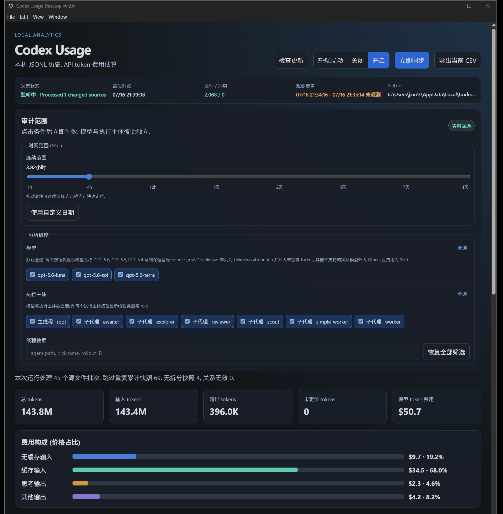
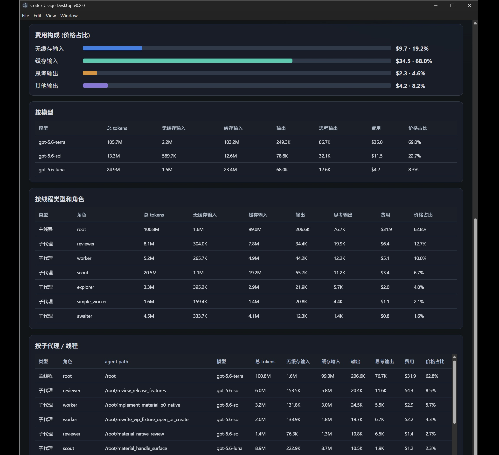

# Codex Usage Desktop

`Codex Usage Desktop` 是一个本地 Windows Electron 应用,用于审计本地 Codex token 用量并估算标准 API token 费用.它持续观察 `%USERPROFILE%\\.codex` 下的 rollout JSONL.后台自动持久化仅写入应用自己的 SQLite ledger;只有用户明确执行 export 时才写入所选 CSV 路径.应用不会上传源数据.通过 NSIS installer 安装的 Windows 应用会在启动时及运行期间每 4 小时检查 GitHub Release;发现更新后,用户点击一次即可下载,校验,静默安装并自动重启. Portable 和 development 版本不执行自动更新.

## 界面预览





## 主要能力

- 后台 tray collector,结合 watcher 驱动的增量读取和周期性 reconciliation.
- 只读观察 active session 与 archived session.
- 按 model 和实际 role 汇总 token 和预估费用.
- 分别展示 input,cached input,output 和 reasoning output token. reasoning output 是 output 的子集,不会重复计费.
- 支持连续 time range,默认折叠且可展开的自定义 Singapore time range,model,execution subject 和 thread search 的实时筛选.连续滑块以 30分钟,4h,12h,1天,2天,4天,7天和14天为均匀锚点,可点击锚点或拖动到锚点之间选择 1.5天或10天等范围.
- role 从实际 rollout/session thread metadata 读取.主线程 role 规范显示为 `root`;subagent 保留实际记录的 role 并可独立筛选和汇总,缺失时显示为 `unknown`.
- 将当前筛选条件匹配的 usage event 导出为 CSV,保存到用户选择且不位于受保护 Codex 目录内的位置.
- 估算 GPT-5.4,GPT-5.5,GPT-5.6 的费用.其他 model 归入未计费的 `Others`.所有 Codex subscription usage 始终按基础 token 费率估算,不计入 long-context multiplier.

## 目录结构

```text
src/                    Electron main process,preload bridge,collector,parser,ledger,renderer,test
scripts/copy-static.mjs 构建时复制 HTML 与 CSS static asset
dist/                   生成的 TypeScript 与 static build output,已忽略
release/                Portable EXE output,已忽略
launch_codex_usage_gui.vbs
                        双击启动最新的 Portable EXE
README_GUI.md           Electron desktop quick guide
AGENTS.md               贡献者和 agent 的工程约束
```

## 快速启动

安装依赖并启动开发版应用:

```powershell
npm install
npm start
```

手动启动时,collector 初始化完成后会显示 dashboard.使用开机自启动时,应用会直接驻留 notification area 而不弹出 dashboard;可通过 tray menu 重新打开 dashboard,立即同步或退出应用.关闭窗口只会隐藏到 notification area,collector 会继续运行.

## VBS 启动器

双击 [launch_codex_usage_gui.vbs](launch_codex_usage_gui.vbs) 会在不显示 console window 的情况下运行 `npm run package:portable:restart`.

如果尚未有 package,先运行 `npm run package:portable`.

## 构建,测试与打包

```powershell
npm run typecheck
npm test
npm run build
npm run package:portable
npm run package:installer
npm run migrate:ledger
npm run portable:restart
npm run package:portable:restart
```

`npm run package:portable` 会在 `release/` 生成 Windows Portable executable.package 使用 `dist/` 中的生成文件.应修改 `src/` 后重新构建,不要编辑生成 output.

`npm run package:installer` 会生成 NSIS installer,`latest.yml` 和 installer blockmap.安装时可选择在 Windows Startup 文件夹创建开机自启动快捷方式;该方式启动后会直接驻留 notification area.卸载时会终止运行中的应用,删除该快捷方式,并提供删除配置与 usage ledger 的可选项.安装后的 GUI 也提供同一个开机自启动开关.

自动更新仅支持通过 NSIS installer 安装的 Windows 应用,并沿用已有安装目录和权限范围.下载完成后,应用会先停止 collector,再以静默模式运行 installer 并重启.发布新版本时,必须从同一次 `npm run package:installer` 构建上传 `latest.yml`,`codex-usage-desktop-setup-<version>-x64.exe` 及其 `.blockmap` 到同一个 published GitHub Release.应用会使用 `latest.yml` 中的 SHA-512 校验下载内容.当前构建未配置代码签名,Windows 可能额外显示 SmartScreen 或未知发布者提示;配置受信任的 Authenticode 签名后才能消除这类提示.

已发布且不含该 updater 的旧版不能自行升级到首个支持自动更新的版本.这一次需要用户手动安装新的 NSIS installer;之后的 NSIS 版本可使用应用内更新.

`npm run migrate:ledger` 会在应用关闭后将旧 portable ledger 从 `release/codex-usage-data/` 迁移到默认 C 盘数据目录.目标已存在时命令会拒绝覆盖.

版本以 `package.json` 的 `version` 为唯一来源,原生窗口标题栏、Portable 与 NSIS installer 使用同一版本.使用 `npm run version:patch`、`npm run version:minor` 或 `npm run version:major` 更新版本,并同步维护 [CHANGELOG.md](CHANGELOG.md).

`npm run portable:restart` 会重启已有的 Portable package.`npm run package:portable:restart` 会先重新打包.两者都会向当前工作区的应用实例发送受路径约束的退出请求,确认 executable 可用后复制到被忽略的 `work/portable-run/` 并启动副本.因此运行实例不会锁定 `release/` 中的打包源文件,并会使用默认的 `%LOCALAPPDATA%` ledger.退出请求超时时,命令只会终止当前工作区 `work/`,`release/` 或开发 Electron 进程树;其他路径的同名应用仍会使命令停止.

## 数据目录与安全边界

应用仅以观察模式读取下列 Codex 目录:

```text
%USERPROFILE%\\.codex\\sessions
%USERPROFILE%\\.codex\\archived_sessions
```

应用不会对这些 source file 加锁,写入,重命名,删除,截断或修复.`%USERPROFILE%\\.codex\\agents` 虽不是观察源,仍属于受保护 Codex 目录,不得作为 output 或 export 目标. collector 的 SQLite ledger 由应用自身拥有,位置如下:

```text
Default:     %LOCALAPPDATA%\\Codex Usage Desktop\\usage.sqlite
Override:    %CODEX_USAGE_DATA_DIR%\\usage.sqlite
```

SQLite lock 仅限于应用自己的 ledger.应用会拒绝任何解析后落在受保护 Codex 目录内的 output 或 export path.

## 文档索引

- [Engineering guide](AGENTS.md): 数据源边界,TypeScript,Electron security,验证和费用统计不变量.
- [Electron quick guide](README_GUI.md): Electron desktop app 的启动,功能与日常使用说明.
- [Architecture](docs/architecture.md): process boundary,watcher owner,IPC 与 ledger design.
- [Cost model](docs/cost-model.md): token accounting,pricing,CSV field 与 price share 定义.
- [Data safety](docs/data-safety.md): read-only source boundary,ledger 和 export safety.
- [Workspace migration](docs/migration-g-project.md): 完整跨盘移动,验证,cutover 和 rollback.
- [Operations](docs/operations.md): collector lifecycle,watcher delay,backup,recovery 与 export.
- [Testing](docs/testing.md): automated verification,read-only desktop smoke 与 release acceptance.
- [Package scripts](package.json): command 与 Portable packaging configuration 的权威定义.

Legacy Python utilities remain as `codex_token_usage_gui.py` and related scripts. They are separate from the Electron desktop application and are not the current product launch path.

## 验证要求

共享代码改动前,运行相关验证并保持 working tree 可检查:

```powershell
npm run typecheck
npm test
git diff --check
```

修改 packaging 时运行 `npm run package:portable`.

## License

This project is licensed under the [MIT License](LICENSE).
