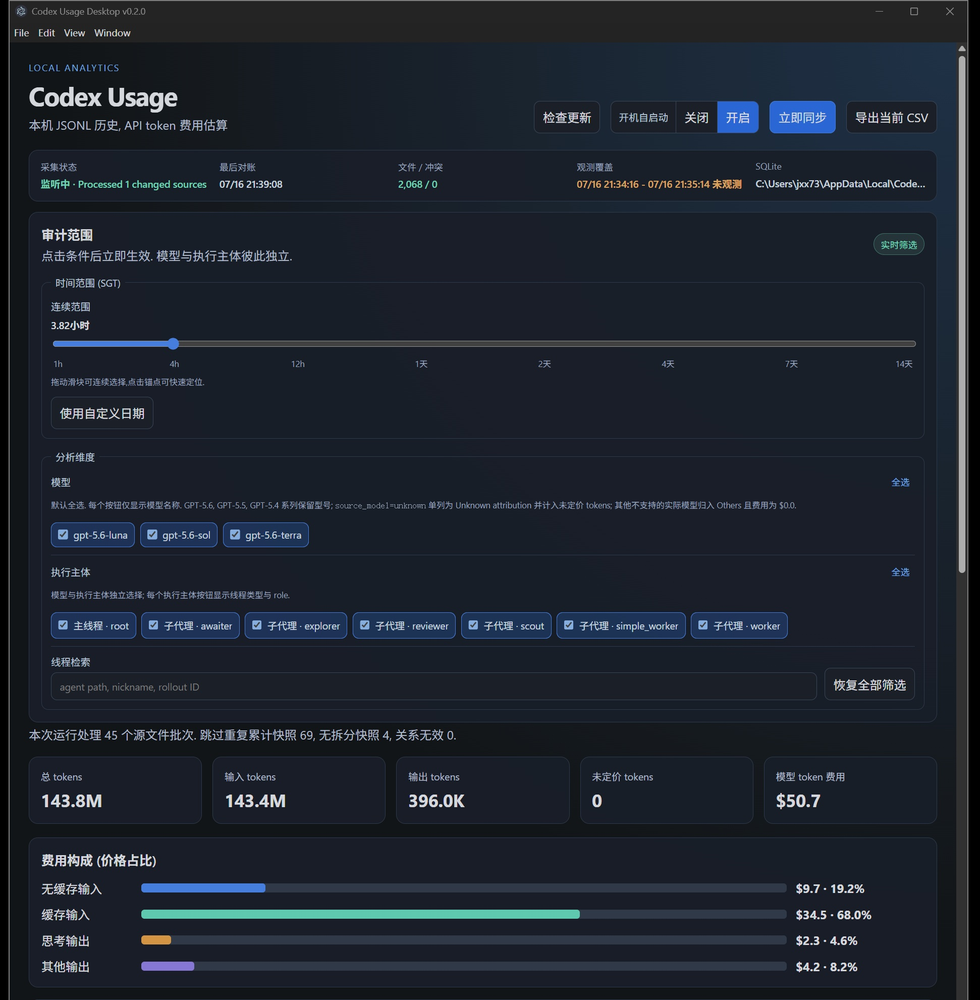
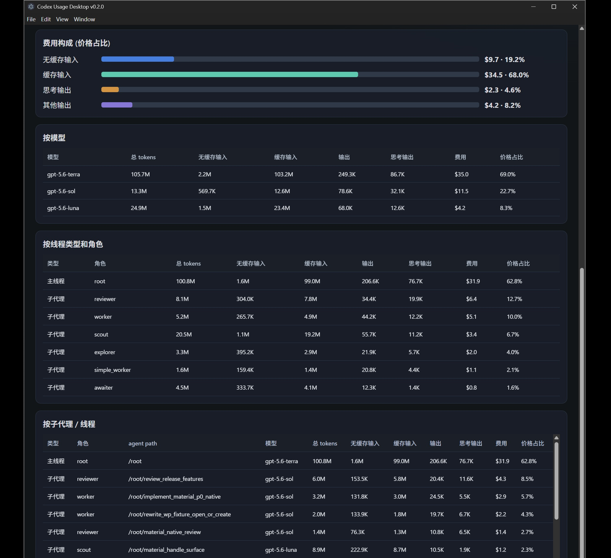

# Codex Usage Desktop

`Codex Usage Desktop` 是一个纯 .NET 8 / WinUI 3 的本地 Windows 审计应用,用于统计 Codex token 用量并估算标准 API token 费用.界面使用 XAML 和 Windows App SDK,不嵌入 WebView2,也不加载 remote content.应用默认离线,rollout 数据不会被上传.





## 架构

```text
src/CodexUsage.App/             WinUI 3 shell,XAML,view model,Windows integration
src/CodexUsage.Application/     lifecycle,query/export orchestration
src/CodexUsage.Infrastructure/  collector,watcher,SQLite ledger,path policy
src/CodexUsage.Domain/          validated rollout parsing,accounting,filtering
tests/                          Domain,Infrastructure,Application tests
CodexUsageDesktop.sln           solution entry
```

一个 .NET process 承载原生 UI、application service 和后台 collector.耗时采集不在 UI thread 中运行,界面只绑定类型化 view model.

## 主要能力

- 只读观察 `%USERPROFILE%\.codex\sessions` 和 `%USERPROFILE%\.codex\archived_sessions`.`agents` 不参与采集,但属于同一禁止写入边界.
- watcher callback 只做轻量入队,collector 通过去重、debounce 和有界 batch 处理增量变化.
- 每 5 分钟运行一次兜底 inventory reconciliation.目录枚举、解析和 hashing 被拆成小片并 cooperative yield,以降低后台 CPU 峰值.
- canonical active/archive promotion 不重复计费.稳定候选只有在 metadata exact 且 semantic relation 为 `Equal` 或 `Extension` 时才可自动恢复;恢复只更新应用 ledger,不会修改 Codex source.
- 按 model、实际 role、thread 和时间范围筛选并汇总 token 与费用.
- `reasoning_output_tokens` 是 `output_tokens` 的子集,不会重复计费.`codex-auto-review` 保持独立未定价分类并计入未定价 tokens,其余 GPT-5.4、GPT-5.5、GPT-5.6 之外的 model 归入未计费的 `Others`,`source_model=unknown` 保持独立 attribution.
- 将当前筛选快照导出为 CSV,并拒绝位于受保护 Codex 目录中的输出路径.

## 数据目录与安全边界

以下目录是严格只读 source:

```text
%USERPROFILE%\.codex\sessions
%USERPROFILE%\.codex\archived_sessions
%USERPROFILE%\.codex\agents
```

应用不会在这些目录内创建、修改、加锁、重命名、删除、截断、修复或移动文件.SQLite lock 只作用于应用自己的 ledger.

```text
Default:  %LOCALAPPDATA%\Codex Usage Desktop\usage.sqlite
Override: %CODEX_USAGE_DATA_DIR%\usage.sqlite
```

`CODEX_USAGE_DATA_DIR` 必须是应用可写且不位于受保护目录内的绝对目录.ledger、cache、migration staging 和 CSV export 均受 resolved-path boundary 检查.

从旧 release 目录复制 ledger 时,先退出应用,然后运行 `scripts/migrate-usage-ledger.ps1 -WhatIf` 预览.该工具要求确认、创建校验过的备份且不删除 source.

## 构建与测试

需要 Windows 11、.NET 8 SDK、Windows 10/11 SDK 和可 restore 的 Microsoft Windows App SDK.从仓库根目录运行:

```powershell
dotnet restore CodexUsageDesktop.sln
dotnet build CodexUsageDesktop.sln -c Release --no-restore
dotnet test CodexUsageDesktop.sln -c Release --no-build
dotnet format CodexUsageDesktop.sln --verify-no-changes
git diff --check
```

生成 x64 全用户安装包:

```powershell
pwsh -NoProfile -File .\scripts\build-installer.ps1 -Version 0.3.2
```

脚本先生成 unpackaged、self-contained 的 WinUI 3 publish,再使用 NSIS 3.x 生成 `release\winui-installer\codex-usage-desktop-setup-0.3.2-x64.exe`.目标计算机无需预装 .NET 或 Windows App SDK runtime.安装范围为全用户,默认写入 `%ProgramFiles%\Codex Usage Desktop`,因此安装、升级和卸载会触发 UAC.

该安装包支持从旧 Electron 0.2.6 原位升级到 WinUI 3.安装器在替换文件前检测并强制终止仍在运行的 Codex Usage Desktop process,保留 `%LOCALAPPDATA%\Codex Usage Desktop\usage.sqlite`,并将 ledger、WAL 和 SHM 复制到 `ledger-backups\preinstall-*`.旧 Startup shortcut 会迁移为当前用户的 HKCU Run entry.新版卸载器默认只移除程序、快捷方式、自启动 entry 和 uninstall registration,不会删除 ledger.

更新检查是 SHA-256 实验功能,仅访问固定的 GitHub Releases endpoint.启动后和每 6 小时的自动检查只读取 metadata;它只接受 `jiangxiaoxu/codex-usage-desktop` 的严格 SemVer release、唯一 x64 installer asset 和 GitHub 提供的 SHA-256 digest.下载完成后,用户必须在“运行安装器”警示 dialog 中明确确认;应用会重新校验 LocalAppData 安装包 SHA-256 和当前 metadata generation,成功后才启动 setup.NSIS 安装器随后会结束当前应用和 collector process 以完成升级.当前 setup EXE 尚未进行 Authenticode 签名,Windows 仍可能显示 `Unknown Publisher` 或 SmartScreen 警告;SHA-256 不能替代可信 code signing.正式发布前仍必须启用 Authenticode signing、时间戳和 publisher allowlist.

## Windows lifecycle

unpackaged 应用通过当前用户的 HKCU Run entry 管理开机自启动,安装器会保留或迁移旧版选择.关闭窗口时应用可驻留 tray;通过 tray 的 `Exit` 完成 collector shutdown 和 ledger checkpoint.窗口失焦后的 Efficiency Mode / process priority 调整仍 deferred,不属于当前已完成行为.更新检查会在启动后立即请求一次固定 GitHub Release metadata,随后每 6 小时检查一次;后台检查不会下载、安装或上传 rollout 数据.

## 文档

- [Native GUI quick guide](README_GUI.md)
- [Architecture](docs/architecture.md)
- [Cost model](docs/cost-model.md)
- [Data safety](docs/data-safety.md)
- [Operations](docs/operations.md)
- [Testing](docs/testing.md)

## License

This project is licensed under the [MIT License](LICENSE).
